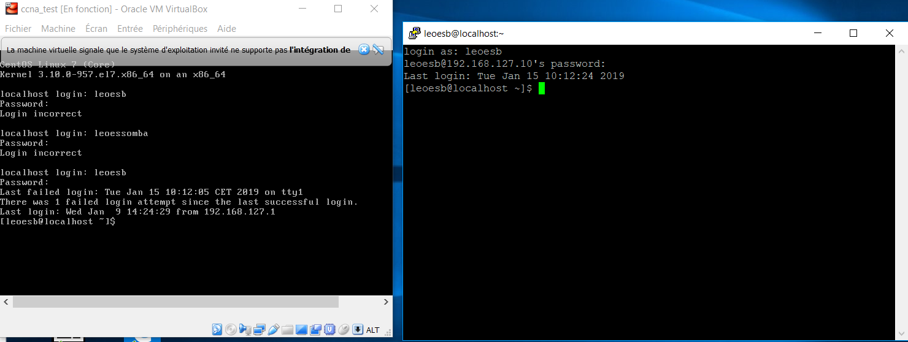
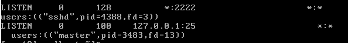
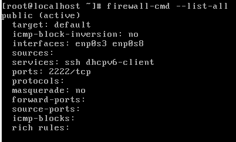
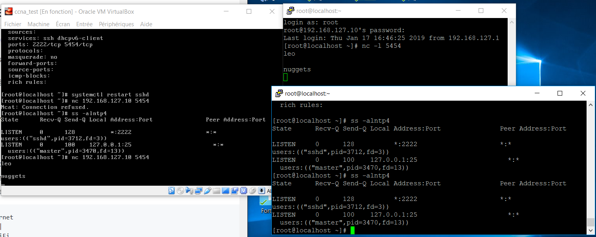
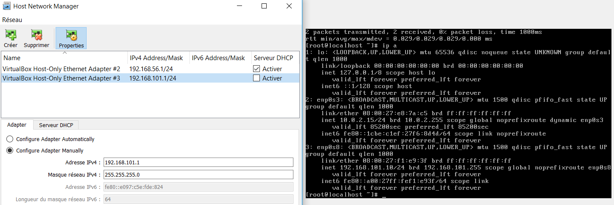
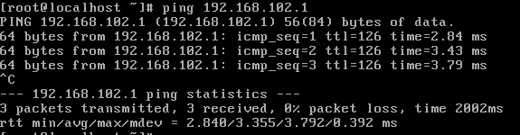
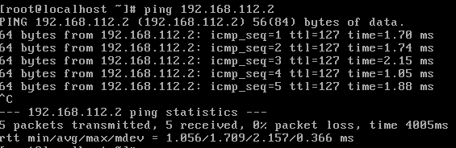
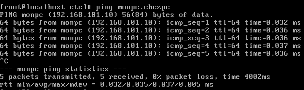

# TP3 CCNA
# 1.Création et utilisation simples d'une VM CentOS
## I-Création
## II-Installation de l'OS
## III-Premier boot
## IV-Config réseau d'une machine CentOS

   *A faire*  
   a. Pour prouver qu'il y a internet sur la VM j'ai utilisé le raccourci :curl google.com  
     
   b. Pour prouver que mon PC et la VM peuvent communiquer j'ai fais la commande: ping 192.168.127.1 et ping 192.168.127.10  
     
     
   c.  
     
   La première ligne est l'adresse IP que l'on devait avoir, la deuxieme ligne est l'adresse IP
   
## V-Faire joujou avec quelques commandes
   *A faire*  
   * cf `Voir IV à faire`  
   * 
     
   
     
   *
     
  
   *
     
   
     
   
   # 2.Notion de ports et SSH
   
  ## I-Exploration des ports locaux
    
  ## II-SSH
    
  ## III-Firewall
  A-SSH
  Modification du port 22 en port 2222
    
  Modif via le Firewall et la connexion a pu etre etabli avec putty
    
  
  B-NETCAT
  yum install nmap-ncat  
    
J'ai pu dialoguer entre mes deux terminals sur le port 5454 mais lorsque je fais mon ss il y a que le port 2222 qui apparait.

   # 3.Routage statique
   
   # II-Configuration du routage
   Voici l'addrese IP de mon PC1 et de la VM1
     
   J'ai ping le réseau 2 depuis ma VM1.
     
   J'ai ping le réseau 12 depuis ma VM1.
     
    
   # III-Configuration des noms de domaine
   J'ai changé mon nom de domaine et j'ai seulement réussi à ping ma propre VM depuis ma VM avec le nom de domaine.
     
