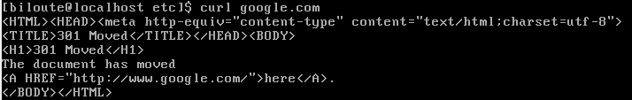

# TP3 CCNA
# 1.Création et utilisation simples d'une VM CentOS
## I-Création
## II-Installation de l'OS
## III-Premier boot
## IV-Config réseau d'une machine CentOS

   *A faire*  
   a. Pour prouver qu'il y a internet sur la VM j'ai utilisé le raccourci :curl google.com  
   
   
   b. Pour prouver que mon PC et la VM peuvent communiquer j'ai fais la commande: ping 192.168.127.1 et ping 192.168.127.10
   
     
   
   c.  
     
   La première ligne est l'adresse IP que l'on devait avoir, la deuxieme ligne est l'adresse IP
   
## V-Faire joujou avec quelques commandes
   *A faire*  
   * cf `Voir IV à faire`  
   * 
   
   *  
   
  
   * 
   
   
   
   
   # 2.Notion de ports et SSH
   
  ## I-Exploration des ports locaux
  
  
  # II-SSH
  
  
